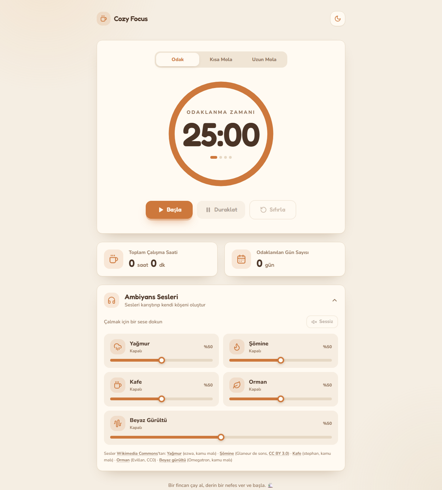
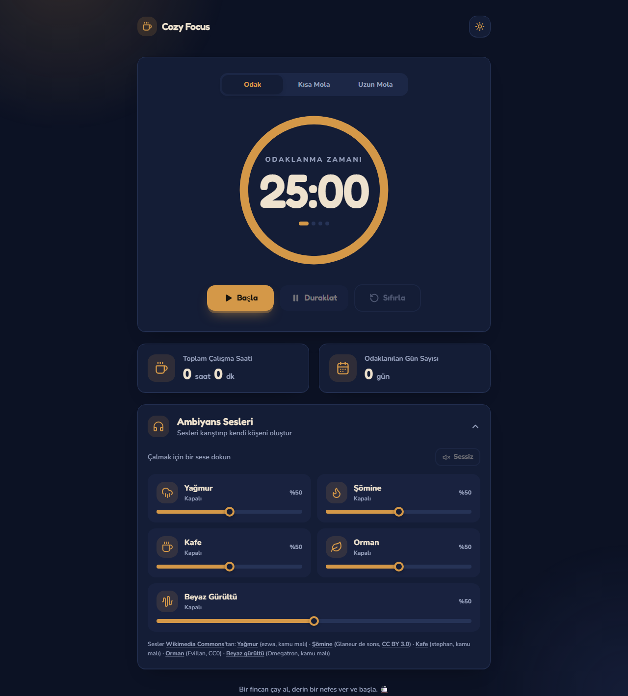

# ☕ Cozy Focus Timer

**Ambiyans sesli, açık ve koyu temalı, sıcak bir Pomodoro odaklanma sayacı.**


Yağmurun sesi, çıtırdayan bir şömine ve bir fincan kahve eşliğinde çalışmak için tasarlanmış tek sayfalık bir odaklanma uygulaması. Pomodoro tekniğiyle çalışır, ilerlemenizi kaydeder ve kendi ambiyans karışımınızı oluşturmanıza izin verir. Hesap, kurulum veya sunucu gerektirmez.

### 👉 [Canlı Demo](https://pietro379.github.io/cozy-focus-timer/)

| Açık tema | Koyu tema |
|---|---|
|  |  |

---

## ✨ Özellikler

### ⏱️ Pomodoro sayacı
- **Üç mod:** Odak (25 dk), Kısa Mola (5 dk), Uzun Mola (15 dk)
- **Başla / Duraklat / Sıfırla** kontrolleri; duraklatınca "Devam Et"
- **Seans döngüsü:** Odak bitince kısa molaya, 4. seanstan sonra uzun molaya geçer
- **Kaymayan süre:** Süre bitiş zaman damgasından hesaplanır; sekme arka planda kalsa da doğru kalır
- **Bitiş zili:** Ses dosyası gerektirmeyen, Web Audio ile üretilen yumuşak bir zil
- **Sekme başlığında** kalan süre görünür (ör. `24:59 · Odak`)

### 📊 İstatistikler
- **Toplam Çalışma Saati:** Saat ve dakika olarak gösterilir
- **Odaklanılan Gün Sayısı:** Her gün en fazla bir kez artar
- Süre, sayaç **bittiğinde, duraklatıldığında veya sıfırlandığında** kaydedilir; sayfa kapanırken çalışan süre de kaybolmaz
- Yalnızca **odak** süresi sayılır, molalar sayılmaz
- Bir gün, o gün en az **1 dakika** çalışıldığında sayılır (yanlışlıkla başlatılan sayaç sayılmasın diye)

### 🎧 Ambiyans sesleri
- **Beş ses:** Yağmur, Şömine, Kafe, Orman, Beyaz Gürültü
- Bir sese dokununca **döngüde** çalmaya başlar; tekrar dokununca durur
- Her sesin **kendi ses seviyesi kaydırıcısı** var
- Birden fazla sesi aynı anda açıp **kendi karışımınızı** oluşturabilirsiniz (ör. Şömine %50 + Yağmur %30)
- **Sessiz** butonu tüm sesleri tek tıkla durdurur
- Sayfa açılışında **hiçbir ses çalmaz** ve hiçbir ses dosyası indirilmez; her dosya ilk tıklandığında yüklenir
- Açma/kapamada yumuşak geçiş; iOS Safari'de de çalışan ses seviyesi (Web Audio `GainNode`)

### 🎨 Tasarım
- **Açık tema:** Yulaf ve krem tonları, soft kahve-turuncu detaylar
- **Koyu tema:** Derin gece mavisi, loş kehribar detaylar
- Tema varsayılan olarak **sistem tercihini** izler; sağ üstteki butonla değiştirilebilir
- Mobil ve masaüstüne uyumlu düzen, klavye ile gezinme ve `prefers-reduced-motion` desteği

---

## 💾 Veriler nerede saklanır?

Tüm veriler tarayıcınızın `localStorage` alanında tutulur; hiçbir sunucuya gönderilmez.

| Anahtar | İçerik |
|---|---|
| `cozy-stats` | Toplam çalışma süresi ve odaklanılan gün sayısı |
| `cozy-theme` | Seçilen tema (`light` / `dark`) |
| `cozy-volumes` | Her ambiyans sesinin seviyesi |

> **Not:** `localStorage` cihaza ve tarayıcıya özeldir. Sayfayı yenilediğinizde veya ertesi gün aynı tarayıcıdan girdiğinizde verileriniz yerinde durur, ancak **farklı bir cihaz veya tarayıcı arasında senkronize olmaz.**

---

## 🚀 Kullanım

En hızlı yol: **[canlı demoyu](https://pietro379.github.io/cozy-focus-timer/) açın.**

Yerelde çalıştırmak için kurulum veya derleme adımı yoktur:

```bash
git clone https://github.com/pietro379/cozy-focus-timer.git
cd cozy-focus-timer
```

Ardından `index.html` dosyasını tarayıcınızda açın.

> Tailwind CSS, Google Fonts ve ambiyans sesleri internetten yüklenir; tam deneyim için bağlantı gerekir.

---

## 🧱 Teknolojiler

| Teknoloji | Kullanım amacı |
|---|---|
| HTML5 | Sayfa yapısı; ses paneli için yerleşik `<details>` öğesi |
| [Tailwind CSS](https://tailwindcss.com/) (CDN) | Arayüz tasarımı |
| CSS değişkenleri | Tek kaynaktan yönetilen açık/koyu tema renkleri |
| Vanilla JavaScript | Uygulama mantığı (framework yok) |
| HTML5 Audio + Web Audio API | Ambiyans sesleri, ses seviyesi ve bitiş zili |
| localStorage | İstatistik, tema ve ses seviyesi kaydı |
| [Fredoka](https://fonts.google.com/specimen/Fredoka) & [Nunito](https://fonts.google.com/specimen/Nunito) | Yazı tipleri |

---

## 📁 Proje Yapısı

```
cozy-focus-timer/
├── index.html   # Sayfa yapısı ve arayüz
├── style.css    # Tema renkleri ve özel bileşen stilleri
├── app.js       # Tema, sayaç, istatistikler ve ses motoru
├── docs/
│   ├── ekran-goruntusu-acik.png
│   └── ekran-goruntusu-koyu.png
└── README.md
```

---

## 🔊 Ses Kaynakları

Tüm ambiyans sesleri [Wikimedia Commons](https://commons.wikimedia.org/)'tan, açık lisanslarla kullanılmaktadır:

| Ses | Dosya | Sahibi | Lisans |
|---|---|---|---|
| Yağmur | [Rain (1).ogg](https://commons.wikimedia.org/wiki/File:Rain_(1).ogg) | ezwa | Kamu malı |
| Şömine | [Campfire sound ambience.ogg](https://commons.wikimedia.org/wiki/File:Campfire_sound_ambience.ogg) | Glaneur de sons | [CC BY 3.0](https://creativecommons.org/licenses/by/3.0/) |
| Kafe | [Restaurant ambience.ogg](https://commons.wikimedia.org/wiki/File:Restaurant_ambience.ogg) | stephan | Kamu malı |
| Orman | [Waidachswald Oberschefflenz Abend 20250616 2005.ogg](https://commons.wikimedia.org/wiki/File:Waidachswald_Oberschefflenz_Abend_20250616_2005.ogg) | Evillan | [CC0](https://creativecommons.org/publicdomain/zero/1.0/) |
| Beyaz Gürültü | [White noise.ogg](https://commons.wikimedia.org/wiki/File:White_noise.ogg) | Omegatron | Kamu malı |

---

## 🗺️ Yol Haritası

- [ ] Ayarlanabilir odak ve mola süreleri
- [ ] Ses dosyalarını projeye dahil ederek çevrimdışı çalışma
- [ ] Haftalık çalışma grafiği
- [ ] Süre bitiminde tarayıcı bildirimi
- [ ] Hesap ile cihazlar arası senkronizasyon

---

## 🤝 Katkıda Bulunma

Hata bildirimleri ve öneriler için [issue](https://github.com/pietro379/cozy-focus-timer/issues) açabilir veya pull request gönderebilirsiniz.
